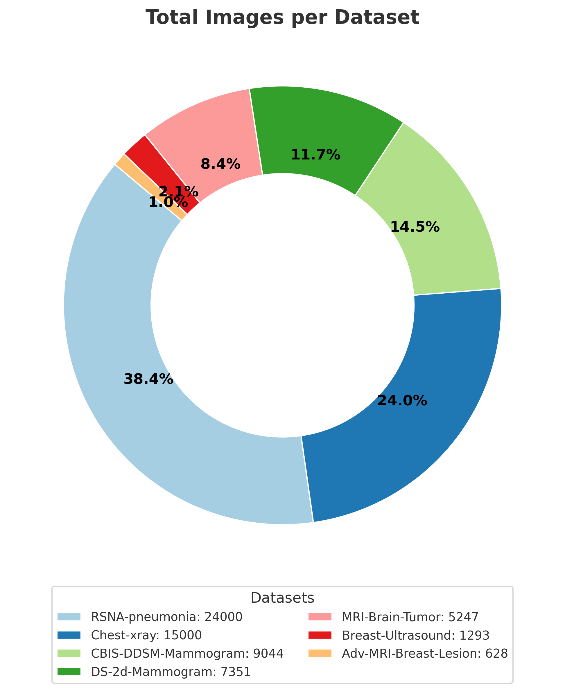

# Meta-Learning for Medical Imaging
Welcome to the project site!  

---
## Abstract

The need to quickly develop and deploy of novel technologies motivates the needs for a meta-learning framework that make use of vast sources of legacy medical imaging data.

---
## Introduction

This project explores **few-shot meta-learning** for object detection in medical imaging datasets.

---
## Methodology

Our approach:

1. Pre-train backbone on conventional datasets.  
2. Meta-train using episodic tasks (few-shot learning).  
3. Fine-tune on target dataset (EIT). 

###  Requirements

The table below shows the minimum hardware and software requirements needed for reproducing the results of this research project. For training the model, we used an A100 NVIDIA GPU with PCIe and 40 GB of vRAM. This is the minimum vRAM needed to be able to train a meta-model without needing any modifications to the code provided in the Github repository. If you have a GPU with lower vRAM, you will need to lower the batch size during training to ensure the batched data can fit in GPU memory. 

| Item         | Minimum Required |
|--------------------------------|
| GPU          | CUDA-enabled with compute capability > 3.0 |
| CUDA Toolkit | 11.8             |
| Storage      | 200 GB           |
| vRAM         | 40 GB            |
| Linux Distro | Ubuntu 22.04     |
| Conda        | 25.1.1           |
| Python       | 3.10             |

### Datasets

{: style="max-width:40%; height:auto; display:block; margin:0; margin-right:1em;" }

To evaluate dataset similary, a histogram plot of 50 randomly sampled grayscale images per dataset was computed and plotted. The grayscale histogram plots below show the raw pixel count of each pixel bit from 1–254, excluding pure black (0) and pure white (255) bit values. 

<figure style="text-align:center;">
  
  <figcaption style="margin-top:0.5em; font-style:italic;">
    Figure 2: Histogram plots obtained by averaging grayscale histograms of 50 randomly sampled images per dataset.
  </figcaption>
</figure>

<figure style="text-align:left;">

  <figure style="flex:1; text-align:center; margin:0;">
    
    <figcaption style="margin-top:1.5em;"> (a) t-SNE of CNN embeddings for all datasets.</figcaption>
  </figure>

  <figure style="flex:1; text-align:center; margin:1;">
    
    <figcaption>(b) Wasserstein distance between Novel EIT data and every dataset.</figcaption>
  </figure>

  <figcaption style="margin-top:0.5em; font-style:italic;">
    Figure 3: Comparing similarity between novel EIT data and all other datasets using two different similarity metrics: (a) 3D t-SNE plot and (b) Wasserstein distance between average histograms.
  </figcaption>

</figure>

The grayscale histogram analysis in Figure 2 demonstrates that the EIT-Novel-Data exhibits a distinct, narrow peak centered around grayscale values of approximately 120 to 150, in contrast to the skewed or multi-modal distributions observed in the remaining datasets. For instance, CBIS-DDSM-Mammogram and MRI-Brain-Tumor display complex multi-peaked structures, while datasets such as Breast-Ultrasound and Advanced-MRI-Breast-Lesion are heavily skewed toward darker intensities. The Wasserstein distance comparison in Figure 3b provides a quantitative assessment of these differences, showing that EIT-Novel-Data grayscale distribution aligns most closely with CBIS-DDSM-Mammogram, followed by RSNA-Pneumonia and Chest X-ray, whereas it diverges strongly from Advanced-MRI-Breast-Lesion and MRI-Brain-Tumor. These findings suggest that, despite being derived from a distinct imaging modality, EIT-Novel-Data shares greater grayscale intensity similarity with mammography and X-ray datasets than with MRI or ultrasound datasets.

The t-SNE visualization in Figure 3a reveals that each dataset forms a distinct cluster in the CNN embedding space, highlighting clear modality-specific differences. The EIT-Novel-Data cluster is positioned relatively close to most of the datasets,  suggesting that it shares feature-level similarity across multiple modalities. Hoever, it's more clearly separated from the Advanced-MRI-Breast-Lesion and chest X-ray datasets. This pattern partially aligns with the Wasserstein analysis since EIT is close to mammography in both views, but despite intensity-based similarity to X-ray, the embedding places EIT farther from the X-ray datasets, indicating that relying on grayscale similarity alone does not always translate to similarity in higher-level features.

### Data Processing Pipeline

### Meta Learning

#### Meta Training

#### Meta Validation

#### Few-Shot Learning

---
## Experiments & Findings

| Dataset | Baseline | Meta-Learning | Δ |
|---------|----------|---------------|---|
| MRI     | 72.3%    | **81.4%**     | +9.1 |
| X-Ray   | 68.5%    | **77.2%**     | +8.7 |

### Experiment 1

  
  

### Experiment 2
The purpose of this ablation study was to determine how the meta-model's performance changes as more tasks are adding during training.

{: style="max-width:100%; height:80%; display:block; margin:0 margin-right:1em;" }

<figure style="text-align:left;">

  

    
    
    
  

  

    
    
    
  

  <figcaption style="margin-top:0.5em; font-style:italic;">
    Figure 2: Box plots for performance metrics mean average precision at IOU 50%, recall, precision and F1 score for meta-models trained on N=2 tasks up to N=7 tasks.
  </figcaption>

</figure>

### Experiment 3
In experiment 2, we wanted to investigate the impact of....

### Experiment 4
In experiment 2, we wanted to investigate the impact of....
    
#### Comparison with Incremental Transfer Learning on Multiple Tasks

{: style="max-width:100%; height:auto; display:block; margin:0 margin-right:1em;" }

{: style="max-width:100%; height:auto; display:block; margin:0 margin-right:1em;" }

#### Few Shot Learning (N=40) on novel EIT data

<figure style="text-align:left;">

  <figure style="flex:1; text-align:center;  margin:0;">
    
    <figcaption>(a) Baseline Transfer Learning</figcaption>
  </figure>

  <figure style="flex:1; text-align:center;  margin:0;">
    
    <figcaption>(b) Finetuning a Meta-Model</figcaption>
  </figure>

  <figcaption style="margin-top:0.5em; font-style:italic;">
    Figure 8: Comparing model performance on the EIT validation set by (a) finetuning YOLO by transfer learning on EIT data for 300 epochs and (b) finetuning a meta-model (n=5) on EIT data for 50 meta-epochs, whereby each meta-epoch consists of 10 training epochs and 5 finetuning epochs on EIT data only. This means 20 meta-epochs is computationally equivalent to 300 epochs used during baseline transfer learning.

  </figcaption>
</figure>

The Meta-Model trained on all five in-distribution tasks retains a better initialization for the task of fine-tuning on the novel EIT dataset, as indicated by the higher mAP50 after the first meta-epoch in Figure (a). In contrast,

#### Very Few Shot Learning (N=20) on novel EIT data

  <figure style="flex:1; text-align:center; margin:0;">
    
    <figcaption>(a) Fine-tuning (50 epochs)</figcaption>
  </figure>

  <figure style="flex:1; text-align:center; margin:0;">
    
    <figcaption>(b) Fine-tuning (70 epochs)</figcaption>
  </figure>

---
## References

1. Finn, C., Abbeel, P., & Levine, S. (2017). Model-Agnostic Meta-Learning (MAML).  
2. Hospedales, T. et al. (2022). Meta-Learning in Neural Networks: A Survey.  
3. Dataset references: ChestX-ray14, BreastMRI, UltrasoundNerveSeg.  
1. Finn, C., Abbeel, P., & Levine, S. (2017). Model-Agnostic Meta-Learning (MAML).  
2. Hospedales, T. et al. (2022). Meta-Learning in Neural Networks: A Survey.  
3. Dataset references: ChestX-ray14, BreastMRI, UltrasoundNerveSeg.
1. Finn, C., Abbeel, P., & Levine, S. (2017). Model-Agnostic Meta-Learning (MAML).  
2. Hospedales, T. et al. (2022). Meta-Learning in Neural Networks: A Survey.  
3. Dataset references: ChestX-ray14, BreastMRI, UltrasoundNerveSeg.
1. Finn, C., Abbeel, P., & Levine, S. (2017). Model-Agnostic Meta-Learning (MAML).  
2. Hospedales, T. et al. (2022). Meta-Learning in Neural Networks: A Survey.  
3. Dataset references: ChestX-ray14, BreastMRI, UltrasoundNerveSeg.
1. Finn, C., Abbeel, P., & Levine, S. (2017). Model-Agnostic Meta-Learning (MAML).  
2. Hospedales, T. et al. (2022). Meta-Learning in Neural Networks: A Survey.  
3. Dataset references: ChestX-ray14, BreastMRI, UltrasoundNerveSeg.

