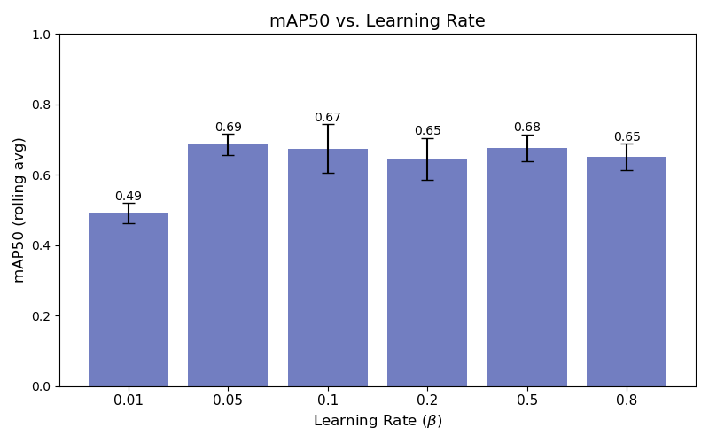
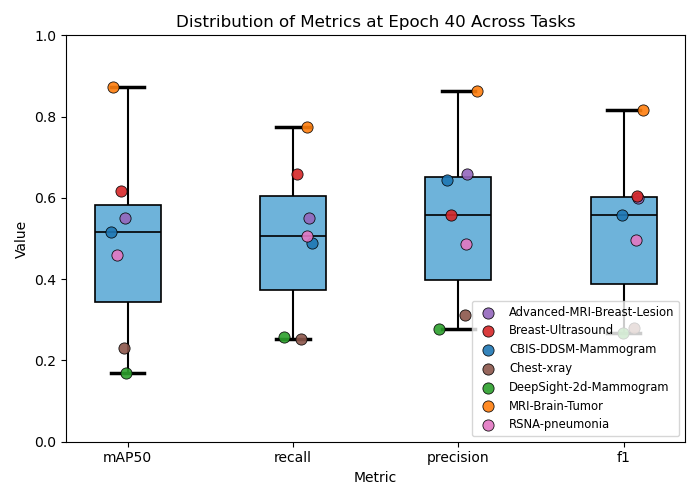
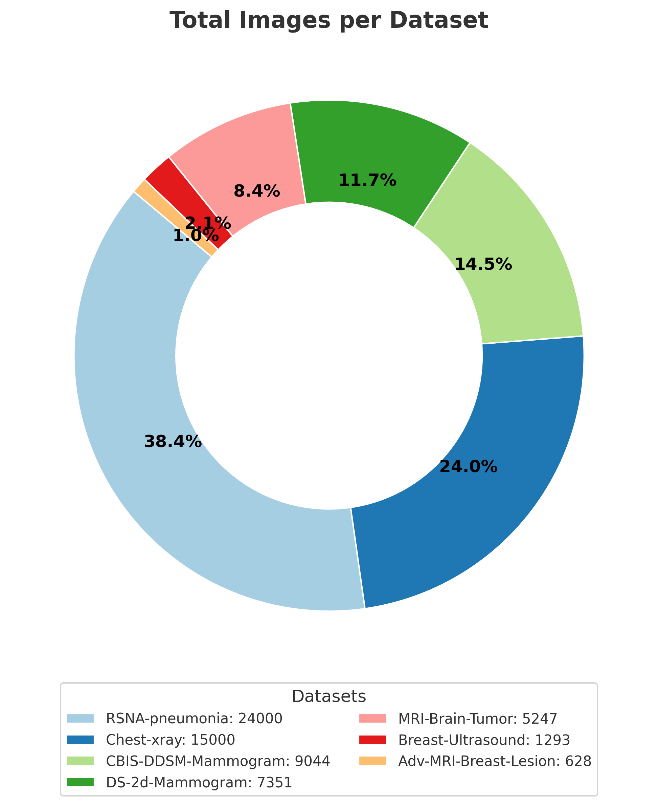

# Meta-Learning for Medical Imaging

Welcome to the project site!  
This project explores **few-shot meta-learning** for object detection in medical imaging datasets.

---

## Methodology

Our approach:

1. Pre-train backbone on conventional datasets.  
2. Meta-train using episodic tasks (few-shot learning).  
3. Fine-tune on target dataset (EIT).  

---

## Experiments & Findings

Datasets:

- Breast MRI  
- Chest X-Ray  
- Ultrasound  

| Dataset | Baseline | Meta-Learning | Δ |
|---------|----------|---------------|---|
| MRI     | 72.3%    | **81.4%**     | +9.1 |
| X-Ray   | 68.5%    | **77.2%**     | +8.7 |

---

## References

1. Finn, C., Abbeel, P., & Levine, S. (2017). Model-Agnostic Meta-Learning (MAML).  
2. Hospedales, T. et al. (2022). Meta-Learning in Neural Networks: A Survey.  
3. Dataset references: ChestX-ray14, BreastMRI, UltrasoundNerveSeg.  
