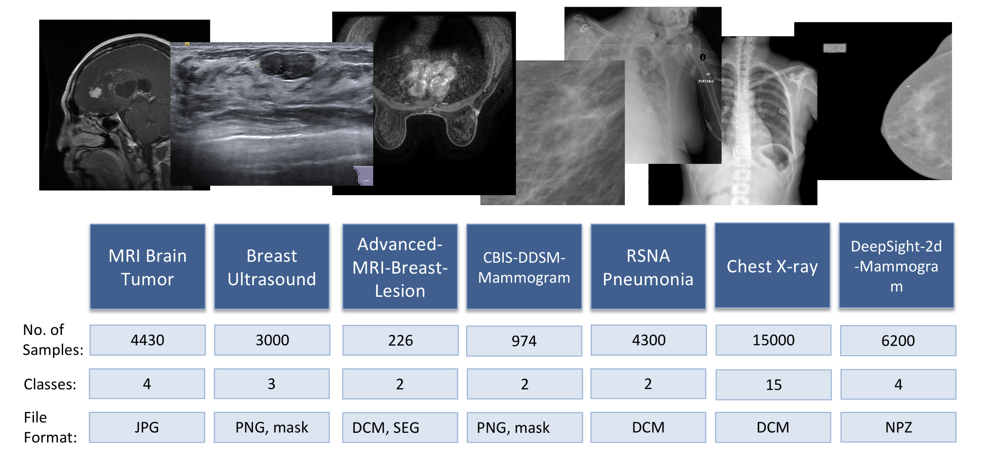

# MEGATRON: Meta-learning for Next-Gen Advanced Technology Realization & Acceleration

<strong>Abstract.</strong> Breast cancer remains the leading cause of cancer-related female mortality worldwide, with current mammography screening methods limited by radiation exposure and accessibility issues. In recent years, Electrical Impedance Tomography (EIT) has shown potential as a cost-effective, non-invasive, and portable alternative for early detection. This
new imaging modality can be paired with deep learning to enhance and speed-up its early detection capabilities. However, its point-of-care adpotion is hindered by insufficient real-world training data for model development. This study presents MEGATRON, a novel meta-learning framework designed to leverage abundant conventional medical imaging datasets to accelerate the development of EIT-based diagnostic tools through few-shot learning capabilities. We developed a comprehensive data processing pipeline that downloads, extracts and processes conventional medical imaging data from multiple modalities (mammography, ultrasound, MRI, X-ray) across various anatomical regions from GREI open-source repositories. The processed data was then used to train a generalized meta-model, before fine-tuning on our proprietary EIT dataset to enable few-shot object detection. The meta-learning approach successfully achieved 88% mean Average Precision (mAP50) on sparse EIT datasets, demonstrating effective knowledge transfer from conventional imaging modalities to novel EIT data, while ablation studies revealed optimal model configurations and identified critical hyperparameters for performance enhancement. This work demonstrates the feasibility of using meta-learning to overcome data scarcity limitations in novel medical imaging technologies, with the MEGATRON framework providing a validated, open-source solution for accelerating the clinical deployment of EIT-based early detection tools and broader applications for emerging diagnostic technologies across multiple domains where real-world data remains limited.

  
<strong>Keywords:</strong> Meta-learning, Data Reuse, Few-shot Learning, Electrical Impedance Tomography, Breast Cancer Detection

---
## Introduction

Breast cancer represents one of the most significant global health challenges, accounting for nearly one-third of all new cancer diagnoses in women in the United States as of 2023 (Siegel et al., 2023). Despite substantial advances in detection and treatment methodologies, breast cancer continues to be the primary source of cancer-related female mortality worldwide (Torre et al., 2015). Current screening paradigms, predominantly relying on mammography, have demonstrated a 20% reduction in breast cancer mortality through widespread implementation (Siegel et al., 2023). However, these conventional approaches face substantial limitations including radiation exposure, high costs, patient discomfort, and accessibility barriers that collectively reduce screening compliance and potentially delay critical early-stage detection (Marmot et al., 2013). The economic burden associated with late-stage breast cancer diagnoses is staggering, with treatment costs frequently exceeding $150,000 per patient (Milliman Research, 2017). Given that approximately one in eight women will be diagnosed with breast cancer during their lifetime, yet many avoid regular screenings due to the aforementioned barriers, there exists an urgent need for alternative diagnostic modalities that can provide accurate, accessible, and patient-friendly screening options (Siegel et al., 2023; Myklebust et al., 2009).

Electrical Impedance Tomography (EIT) has emerged as a promising non-invasive imaging modality that offers significant advantages over conventional screening methods. EIT technology provides portable, radiation-free imaging capabilities that can potentially transform point-of-care breast cancer screening, particularly in resource-limited settings or for patients who experience discomfort with traditional mammography procedures (Halter et al., 2008). The fundamental principle underlying EIT involves the measurement of electrical impedance variations within biological tissues, which can reveal pathological changes indicative of malignant processes.
Recent developments in EIT technology have demonstrated considerable potential for early breast cancer detection, with several studies showing promising results when combined with advanced signal processing and machine learning algorithms (Polydorides & Lionheart, 2002; Lionheart, 2004). However, the clinical translation and widespread adoption of EIT-based diagnostic tools face a critical bottleneck: the scarcity of sufficient real-world EIT datasets required for training robust machine learning models capable of accurate tumor detection and classification.

The development of effective machine learning algorithms for medical imaging typically requires extensive datasets comprising thousands to millions of labeled examples to achieve clinically acceptable performance levels. Traditional approaches to addressing this requirement in emerging imaging modalities like EIT have relied heavily on synthetic data generation and physics-based simulations (Liu et al., 2018). While synthetic data has proven useful for initial algorithm development, it inherently fails to capture the pathological variability and demographic diversity present in real-world clinical environments, resulting in models that may perform well in idealized laboratory settings but demonstrate limited generalizability to actual patient populations. The challenges associated with synthetic data generation extend beyond mere representational limitations. Creating realistic synthetic EIT datasets requires extensive computational resources, deep understanding of the underlying physics, and careful consideration of noise characteristics that mirror real-world acquisition conditions. Concurrently, vast amounts of conventional medical imaging data from established modalities such as mammography, ultrasound, MRI, and computed tomography remain underutilized in the development of novel imaging technologies. These datasets, accumulated over decades of clinical practice and research, represent a rich repository of labeled pathological and normal cases that could potentially accelerate the development of emerging diagnostic modalities if appropriately leveraged.

Meta-learning, often described as "learning to learn," presents a compelling solution to the data scarcity challenge facing novel medical imaging technologies (Finn et al., 2017). This paradigm enables machine learning models to rapidly adapt to new tasks with minimal training data by leveraging knowledge gained from related tasks during a meta-training phase. In the context of medical imaging, meta-learning offers the possibility of training models on abundant conventional datasets and subsequently fine-tuning them for novel modalities with limited available data. The application of meta-learning to medical imaging represents a paradigm shift from traditional single-task learning approaches toward more generalizable, adaptable systems that can extract universal feature representations applicable across different imaging modalities. This approach is particularly relevant for emerging technologies like EIT, where the fundamental task of identifying pathological tissue changes shares commonalities with established imaging modalities, despite differences in acquisition methods and image characteristics.

This study presents MEGATRON: Meta-learning for Next-Gen Advanced Technology Realization & Acceleration, a comprehensive framework designed to address the data scarcity limitations hindering the clinical deployment of EIT-based breast cancer detection systems. The primary objective of this research is to demonstrate the feasibility and effectiveness of using meta-learning approaches trained on conventional medical imaging datasets to enable accurate few-shot learning on limited EIT data.

Our work makes several significant contributions to the field of medical imaging and machine learning. We present an automated, robust ETL (Extract, Transform, Load) pipeline capable of ingesting and standardizing heterogeneous medical imaging data from multiple open-source repositories, formats, and modalities, while introducing a novel meta-learning framework specifically designed for medical imaging tasks that can effectively transfer knowledge from conventional imaging modalities to emerging technologies like EIT. Our study provides empirical evidence for the effectiveness of cross-modal knowledge transfer between different medical imaging modalities, demonstrating that features learned from conventional imaging can enhance performance on novel imaging tasks. Additionally, we contribute a validated, reproducible open-source framework that can be applied beyond EIT to accelerate the development of various emerging diagnostic technologies facing similar data scarcity challenges, establishing a practical pathway for translating research-stage imaging technologies into clinically deployable tools by leveraging existing data resources.

The implications of this research extend beyond breast cancer detection and EIT technology. The meta-learning framework presented here addresses a fundamental challenge in medical technology development: the need to validate and deploy novel diagnostic tools rapidly while ensuring clinical accuracy and reliability. By demonstrating effective knowledge transfer across imaging modalities, this work opens new avenues for accelerating medical innovation and improving patient outcomes through faster technology translation.
The remainder of this paper presents our methodology, experimental results, and analysis of the MEGATRON framework's performance in enabling few-shot learning for EIT-based breast cancer detection, along with a discussion of broader applications and future research directions.

---
## Methodology

Our approach:

1. Pre-train backbone on conventional datasets.  
2. Meta-train using episodic tasks (few-shot learning).  
3. Fine-tune on target dataset (EIT). 

###  Requirements

The table below shows the minimum hardware and software requirements needed for reproducing the results of this research project. For training the model, we used an A100 NVIDIA GPU with PCIe and 40 GB of vRAM. This is the minimum vRAM needed to be able to train a meta-model across all datasets without needing any modifications to the code provided in the Github repository. If you have a GPU with lower vRAM, you will need to lower the batch size during training to ensure the model and batched data can fit within the stipulated GPU memory. 

| Item         | Minimum Required |
|--------------------------------|
| GPU          | CUDA-enabled with compute capability > 3.0 |
| CUDA Toolkit | 11.8             |
| Storage      | 200 GB           |
| vRAM         | 40 GB            |
| Linux Distro | Ubuntu 22.04     |
| Conda        | 25.1.1           |
| Python       | 3.10             |

### Datasets

{: style="max-width:100%; height:auto; display:block; margin:0; margin-right:1em;" }

 Since the purpose of this study is to develop a meta-model that can specifically adapt to our novel EIT dataset in a few-shot learning scenario, it is essential to identify which datasets share the greatest similarity with the EIT data and would therefore be most likely to produce positive transfer effects during meta-model training. To evaluate dataset similarity, we employed multiple complementary approaches. First, histogram plots were generated from 50 randomly sampled grayscale images per dataset, capturing the distribution of pixel intensities from 1–254. excluding pure black and white values at 0 and 255. We then computed Wasserstein distances between the target EIT-Novel-Data histogram and all other dataset histograms to quantify distributional differences. We also generated t-SNE embeddings to visualize high-dimensional relationships between datasets. 

<figure style="text-align:center;">
  
  <figcaption style="margin-top:0.5em; font-style:italic;">
    Figure 2: Histogram plots obtained by averaging grayscale histograms of 50 randomly sampled images per dataset.
  </figcaption>
</figure>

<figure style="text-align:left;">

  <figure style="flex:1; text-align:center; margin:0;">
    
    <figcaption style="margin-top:1.5em;"> (a) t-SNE of CNN embeddings for all datasets.</figcaption>
  </figure>

  <figure style="flex:1; text-align:center; margin:1;">
    
    <figcaption>(b) Wasserstein distance between Novel EIT data and every dataset.</figcaption>
  </figure>

  <figcaption style="margin-top:0.5em; font-style:italic;">
    Figure 3: Comparing similarity between novel EIT data and all other datasets using two different similarity metrics: (a) 3D t-SNE plot and (b) Wasserstein distance between average histograms.
  </figcaption>

</figure>

The grayscale histogram analysis in Figure 2 demonstrates that the EIT-Novel-Data exhibits a distinct, narrow peak centered around grayscale values of approximately 120 to 150, in contrast to the skewed or multi-modal distributions observed in the remaining datasets. For instance, CBIS-DDSM-Mammogram and MRI-Brain-Tumor display complex multi-peaked structures, while datasets such as Breast-Ultrasound and Advanced-MRI-Breast-Lesion are heavily skewed toward darker intensities, and X-ray datasets contain a wide range of pixel intensities as shown by their broader spectrums. The Wasserstein distance comparison in Figure 3b provides a quantitative assessment of these differences, showing that EIT-Novel-Data grayscale distribution aligns most closely with CBIS-DDSM-Mammogram, followed by RSNA-Pneumonia and Chest X-ray, whereas it diverges strongly from Advanced-MRI-Breast-Lesion and MRI-Brain-Tumor. These findings suggest that, despite being derived from a distinct imaging modality, EIT-Novel-Data shares greater grayscale intensity similarity with mammography and X-ray datasets than with MRI or ultrasound datasets.

The t-SNE visualization in Figure 3a reveals that each dataset forms a distinct cluster in the CNN embedding space, highlighting clear modality-specific differences. The EIT-Novel-Data cluster is positioned relatively close to most of the datasets,  suggesting that it shares feature-level similarity across multiple modalities. Hoever, it's more clearly separated from the Advanced-MRI-Breast-Lesion and chest X-ray datasets. This pattern partially aligns with the Wasserstein analysis since EIT is close to mammography in both views, but despite intensity-based similarity to X-ray, the embedding places EIT farther from the X-ray datasets, indicating that relying on grayscale similarity alone is insufficient when determining similarity in representational structures.

We hypothesize that training a meta-model using datasets that are proximally-close to the target dataset in the embedding space will yield the best model performance since meta-learning involves learning to learn from limited data, and proximally-related tasks share similar representational structures, thus providing more relevant prior knowledge for rapid adaptation to the target domain. 

### Data Processing Pipeline

### Meta Learning

#### Meta Training

#### Meta Validation

#### Few-Shot Learning

---
## Experiments & Findings

| Dataset | Baseline | Meta-Learning | Δ |
|---------|----------|---------------|---|
| MRI     | 72.3%    | **81.4%**     | +9.1 |
| X-Ray   | 68.5%    | **77.2%**     | +8.7 |

### Experiment 1 - Optimal Meta-Learning Rate

  
  

### Experiment 2 - Task Dependence
The purpose of this experiment was to determine how the meta-model's performance changes as more tasks are adding during training.

<figure style="text-align:center;">
  
  <figcaption style="margin-top:0.5em; font-style:italic;">
    Figure X: Impact on meta-model performance (mAP50, precision, recall) as more tasks are added during meta-training.
  </figcaption>
</figure>

<figure style="text-align:left;">

  

    
    
    
  

  

    
    
    
  

  <figcaption style="margin-top:0.5em; font-style:italic;">
    Figure X: Box plots for various performance metrics including mean average precision at IOU 50%, recall, precision and F1 score for meta-models trained on N=2 to N=7 tasks.
  </figcaption>

</figure>

The results demonstrate how meta-model generalization performance varies with task diversity in a meta-learning framework. Figure X reveals that meta-model performance follows an inverted U-shaped curve when scaling from 2 to 7 tasks, with peak performance achieved at 4-5 tasks. The chart shows that mAP50 increases from 0.66 (2 tasks) to a maximum of 0.69 (5 tasks) before declining to 0.49 (7 tasks).

This performance trajectory supports the hypothesis that meta-model generalization benefits from increased task diversity up to an optimal point. The initial improvement going from 2 to 5 tasks suggests that exposure to more diverse medical imaging tasks enhances the meta-learner's ability to quickly adapt to new detection problems by learning more generalizable feature representations and adaptation strategies.

The boxplots in Figure X provide additional granularity in the model behavior, and illustrate how different task characteristics contribute to this meta-learning dynamic. The inclusion of diverse modalities (mammography, MRI, ultrasound, chest X-ray) exposes the meta-learner to varied visual patterns, tumor sizes and boundaries, grayscale intensities, and imaging artifacts. While MRI-Brain-Tumor maintains consistently high performance (~0.85-0.90 mAP50) due to its high quality annotations and detection ease, the challenging DeepSight-2d-Mammogram dataset with reduced image contrast provides valuable learning signal for the meta-model despite its individual poor performance of ~0.2-0.3 mAP50. 

However, beyond 5 tasks, the meta-model's generalizability begins to deteriorate with the inclusion of out-of-distribution chest X-ray tasks. This is due to task interference introducing negative transfer effects that counter the benefits of diversity. The performance degradation is most pronounced in precision, suggesting that discriminative capabilities become compromised when the meta-learner attempts to accommodate too many disparate visual domains and detection requirements simultaneously.

These findings indicate an optimal selection of tasks with sufficient heterogeneity to improve generalization without causing destructive interference to the meta-model's learned parameters.

### Experiment 3
In experiment 2, we wanted to investigate the impact of....

### Experiment 4
In experiment 2, we wanted to investigate the impact of....
    
#### Comparison with Incremental Transfer Learning on Multiple Tasks

We performed standard transfer learning on three datasets in an incremental fashion to benchmark the performance of our meta-model against a conventionally fine-tuned model. We performed transfer learning in two ways, namely with and without freezing layers between tasks, and obtained two models whose performance on the validation set per dataset during the training schedule is shown below.
<figure style="text-align:left;">

  

    <figure style="text-align:center; margin:0 0 1em 0;">
        
        <figcaption>(a) Incremental Transfer Learning without freezing layers between tasks.</figcaption>
    </figure>
    <figure style="text-align:center; margin:0;">
        
        <figcaption>(b) Incremental Transfer Learning with 10 frozen layers after task 1, and 15 frozen layers after task 2.</figcaption>
    </figure>
  

  <figcaption style="margin-top:0.5em; font-style:italic;">
  Figure 7: Training two model on three tasks using incremental transfer learning where by (a) has no frozen layers between tasks and (b) uses 10 and 15 frozen layers after the addition of the second and third task, respectively.
  </figcaption>

</figure>

A comparison between meta-learning and incremental transfer learning reveals several critical insights about multi-task medical imaging performance. Both approaches demonstrate consistent relative dataset difficulty rankings, with MRI-Brain-Tumor achieving the highest performance of 0.94 with meta-learning and 0.9 with transfer learning, and DeepSight-2d-Mammogram showing the poorest results of 0.54 with meta-learning and 0.3 transfer learning. Notably, CBIS-DDSM-Mammogram exhibits remarkably similar performance between approaches (~0.76 vs ~0.75), suggesting this dataset represents an optimal difficulty level for both learning paradigms.

The incremental transfer learning results reveal severe limitations inherent to sequential fine-tuning approaches. The line plots demonstrate clear evidence of catastrophic forgetting, where previously learned tasks experience immediate and severe performance degradation to near-zero mAP50 when the model begins learning subsequent tasks. These results show that traditional fine-tuning approaches cannot maintain multi-task competency in medical imaging domains, and are especially unfit for use cases where a new dataset needs to be integrated in the training pipeline.

In contrast, the meta-learning approach successfully avoids catastrophic forgetting entirely, maintaining functional performance across all seven tasks simultaneously as shown in the spider plot. This multi-task retention capability is especially valuable for challenging datasets like DeepSight-2d-Mammogram, where meta-learning (0.54) substantially outperforms the transfer learning approach (0.3), demonstrating superior knowledge integration. 

TODO: move this elsewhere. These findings underscore meta-learning's fundamental strength in development of novel imaging applications or in resource-constrained settings. In settings where collecting vast amounts of data is impractical, one can leverage highly efficient meta-models which preserve knowledge across diverse diagnostic tasks to close the gap.

#### Few Shot Learning (N=40) on novel EIT data

<figure style="text-align:left;">

  <figure style="flex:1; text-align:center;  margin:0;">
    
    <figcaption>(a) Baseline Transfer Learning</figcaption>
  </figure>

  <figure style="flex:1; text-align:center;  margin:0;">
    
    <figcaption>(b) Finetuning a Meta-Model</figcaption>
  </figure>

  <figcaption style="margin-top:0.5em; font-style:italic;">
    Figure 8: Comparing model performance on the EIT validation set by (a) finetuning YOLO by transfer learning on EIT data for 300 epochs and (b) finetuning a meta-model (n=5) on EIT data for 50 meta-epochs, whereby each meta-epoch consists of 10 training epochs and 5 finetuning epochs on EIT data only. This means 20 meta-epochs is computationally equivalent to 300 epochs used during baseline transfer learning.

  </figcaption>
</figure>

The Meta-Model trained on all five in-distribution tasks retains a better initialization for the task of fine-tuning on the novel EIT dataset, as indicated by the higher mAP50 after the first meta-epoch in Figure (a). In contrast,

#### Very Few Shot Learning (N=20) on novel EIT data

  <figure style="flex:1; text-align:center; margin:0;">
    
    <figcaption>(a) Fine-tuning (50 epochs)</figcaption>
  </figure>

  <figure style="flex:1; text-align:center; margin:0;">
    
    <figcaption>(b) Fine-tuning (70 epochs)</figcaption>
  </figure>

## Conclusion

---
## References

1. Finn, C., Abbeel, P., & Levine, S. (2017). Model-Agnostic Meta-Learning (MAML).  
2. Hospedales, T. et al. (2022). Meta-Learning in Neural Networks: A Survey.  
3. Dataset references: ChestX-ray14, BreastMRI, UltrasoundNerveSeg.  
1. Finn, C., Abbeel, P., & Levine, S. (2017). Model-Agnostic Meta-Learning (MAML).  
2. Hospedales, T. et al. (2022). Meta-Learning in Neural Networks: A Survey.  
3. Dataset references: ChestX-ray14, BreastMRI, UltrasoundNerveSeg.
1. Finn, C., Abbeel, P., & Levine, S. (2017). Model-Agnostic Meta-Learning (MAML).  
2. Hospedales, T. et al. (2022). Meta-Learning in Neural Networks: A Survey.  
3. Dataset references: ChestX-ray14, BreastMRI, UltrasoundNerveSeg.
1. Finn, C., Abbeel, P., & Levine, S. (2017). Model-Agnostic Meta-Learning (MAML).  
2. Hospedales, T. et al. (2022). Meta-Learning in Neural Networks: A Survey.  
3. Dataset references: ChestX-ray14, BreastMRI, UltrasoundNerveSeg.
1. Finn, C., Abbeel, P., & Levine, S. (2017). Model-Agnostic Meta-Learning (MAML).  
2. Hospedales, T. et al. (2022). Meta-Learning in Neural Networks: A Survey.  
3. Dataset references: ChestX-ray14, BreastMRI, UltrasoundNerveSeg.

