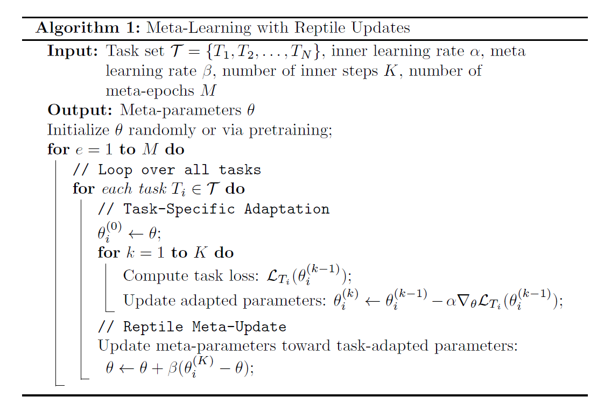
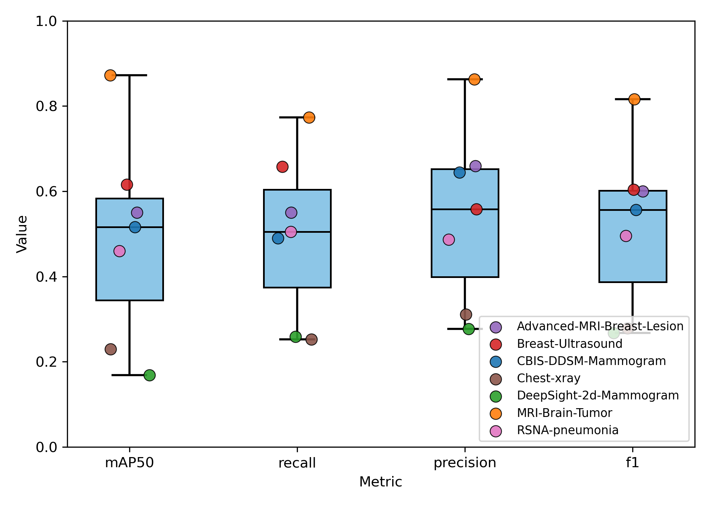

# MEGATRON: Meta-Learning for Next-Generation Advanced Technology Realization & Acceleration

<strong>Abstract.</strong> Breast cancer remains the leading cause of cancer-related female mortality worldwide, with current mammography screening methods limited by radiation exposure and accessibility issues. In recent years, Electrical Impedance Tomography (EIT) has shown potential as a cost-effective, non-invasive, and portable alternative for early detection. This new imaging modality can be paired with deep learning to enhance and speed-up its early detection capabilities. However, its point-of-care adoption is hindered by insufficient real-world training data for model development. This study presents MEGATRON, a meta-learning framework designed to leverage abundant conventional medical imaging data to accelerate the development of EIT-based diagnostic tools through few-shot learning capabilities. We develop a comprehensive data processing pipeline that processes conventional medical imaging data from multiple modalities (mammography, ultrasound, MRI, X-ray) across various anatomical regions from GREI open-source repositories. The processed data is then used to train a generalized meta-model, before fine-tuning on a proprietary EIT dataset to enable few-shot object detection. Results from systematic experiments determine the optimal model configurations and hyperparameter settings needed to maximize performance. Our meta-model successfully achieves 88% mean Average Precision (mAP50) on sparse EIT data, demonstrating effective knowledge transfer from conventional imaging modalities to novel EIT data. This work demonstrates the feasibility of using meta-learning to overcome data scarcity limitations in novel medical imaging technologies, with the MEGATRON framework providing a validated, open-source solution for accelerating the clinical deployment of EIT-based early detection tools, and broader applications for emerging diagnostic technologies across multiple domains where real-world data remains limited.

  
<strong>Keywords:</strong> Meta-learning, Data Reuse, Few-shot Learning, Electrical Impedance Tomography, Breast Cancer Detection

  
  
  

---
## Introduction

Breast cancer represents one of the most significant global health challenges, accounting for nearly one-third of all new cancer diagnoses in women in the United States as of 2023 (Siegel et al., 2023). Despite substantial advances in detection and treatment methodologies, breast cancer continues to be the primary source of cancer-related female mortality worldwide (Torre et al., 2015). Current screening paradigms, predominantly relying on mammography, have demonstrated a 20% reduction in breast cancer mortality through widespread implementation (Siegel et al., 2023). However, these conventional approaches face substantial limitations including radiation exposure, high costs, patient discomfort, and accessibility barriers that collectively reduce screening compliance and potentially delay critical early-stage detection (Marmot et al., 2013). The economic burden associated with late-stage breast cancer diagnoses is staggering, with treatment costs frequently exceeding $150,000 per patient (Milliman Research, 2017). Given that approximately one in eight women will be diagnosed with breast cancer during their lifetime, yet many avoid regular screenings due to the aforementioned barriers, there exists an urgent need for alternative diagnostic modalities that can provide accurate, accessible, and patient-friendly screening options (Siegel et al., 2023; Myklebust et al., 2009).

  

Electrical Impedance Tomography (EIT) has emerged as a promising non-invasive imaging modality that offers significant advantages over conventional screening methods. EIT technology provides portable, radiation-free imaging capabilities that can potentially transform point-of-care breast cancer screening, particularly in resource-limited settings or for patients who experience discomfort with traditional mammography procedures (Halter et al., 2008). The fundamental principle underlying EIT involves the measurement of electrical impedance variations within biological tissues, which can reveal pathological changes indicative of malignant processes. Recent developments in EIT technology have demonstrated considerable potential for early breast cancer detection, with several studies showing promising results when combined with advanced signal processing and machine learning algorithms (Polydorides & Lionheart, 2002; Lionheart, 2004). However, the clinical translation and widespread adoption of EIT-based diagnostic tools face a critical bottleneck: the scarcity of sufficient real-world EIT datasets required for training robust machine learning models capable of accurate tumor detection and classification.

  

The development of effective machine learning algorithms for medical imaging typically requires extensive datasets comprising thousands to millions of labeled examples to achieve clinically acceptable performance levels. Traditional approaches to addressing this requirement in emerging imaging modalities like EIT have relied heavily on synthetic data generation and physics-based simulations (Liu et al., 2018). While synthetic data has proven useful for initial algorithm development, it inherently fails to capture the pathological variability and demographic diversity present in real-world clinical environments, resulting in models that may perform well in idealized laboratory settings but demonstrate limited generalizability to actual patient populations. The challenges associated with synthetic data generation extend beyond mere representational limitations. Creating realistic synthetic EIT datasets requires extensive computational resources, deep understanding of the underlying physics, and careful consideration of noise characteristics that mirror real-world acquisition conditions. Concurrently, vast amounts of conventional medical imaging data from established modalities such as mammography, ultrasound, MRI, and X-ray remain underutilized in the development of novel imaging technologies. These datasets, accumulated over decades of clinical practice and research, represent a rich repository of expertly annotated pathological and normal cases that could potentially accelerate the development of emerging diagnostic modalities if appropriately leveraged.

  

Meta-learning, often described as "learning to learn," presents a compelling solution to the data scarcity challenge facing novel medical imaging technologies (Finn et al., 2017). This paradigm enables machine learning models to rapidly adapt to new tasks with minimal training data by leveraging knowledge gained from related tasks during a meta-training phase. In the context of medical imaging, meta-learning offers the possibility of training models on abundant conventional datasets and subsequently fine-tuning them for novel modalities with limited available data. The application of meta-learning to medical imaging represents a paradigm shift from traditional single-task learning approaches toward more generalizable, adaptable systems that can extract universal feature representations applicable across different imaging modalities. This approach is particularly relevant for emerging technologies like EIT, where the fundamental task of identifying pathological tissue changes shares commonalities with established imaging modalities, despite differences in acquisition methods and image characteristics.

  

This study presents MEGATRON: Meta-Learning for Next-Generation Advanced Technology Realization & Acceleration, a comprehensive framework designed to address the data scarcity limitations hindering the clinical deployment of EIT-based breast cancer detection systems. The primary objective of this research is to demonstrate the feasibility and effectiveness of using meta-learning approaches trained on conventional medical imaging datasets to enable accurate few-shot tumor detection on limited EIT data. We present an automated, robust ETL (Extract, Transform, Load) pipeline capable of ingesting and standardizing heterogeneous medical imaging data from multiple open-source repositories, formats, and modalities, while introducing a novel meta-learning framework specifically designed for medical imaging tasks that can effectively transfer knowledge from conventional imaging modalities to emerging technologies like EIT. Our study provides empirical evidence for the effectiveness of cross-modal knowledge transfer between different medical imaging modalities, demonstrating that features learned from conventional imaging can enhance performance on novel imaging tasks. Additionally, we contribute a validated, reproducible open-source framework that can be applied beyond EIT to accelerate the development of various emerging diagnostic technologies facing similar data scarcity challenges, establishing a practical pathway for translating research-stage imaging technologies into clinically deployable tools by leveraging existing data resources.

  

The implications of this research extend beyond breast cancer detection and EIT technology. The meta-learning framework presented here addresses a fundamental challenge in medical technology development, that is, the need to validate and deploy novel diagnostic tools rapidly while ensuring clinical accuracy and reliability. By demonstrating effective knowledge transfer across imaging modalities, this work opens new avenues for accelerating medical innovation and improving patient outcomes through faster technology translation.
The remainder of this paper presents our methodology, experimental results, and analysis of the MEGATRON framework's performance in enabling few-shot learning for EIT-based breast cancer detection, along with a discussion of broader applications and future research directions.

---
## Methodology

Our methodology is organized into two interconnected pipelines.

**Data Processing Pipeline:**

To enable robust training across diverse medical imaging modalities, we design a scalable data pipeline that integrates different repositories from GREI e.g., Dataverse, Figshare, Mendeley, Zenodo. The pipeline complies with FAIR principles, enabling automated ingestion, transformation, and storage of large, heterogeneous medical imaging datasets.  The steps are:

1. Extract – Ingest raw imaging datasets from conventional modalities (e.g., MRI, X-ray, ultrasound) and Electrical Impedance Tomography (EIT) from remote URLs and online repositories.

2. Transform – Normalize metadata formats, ensure consistent labeling, and remove corrupted or incomplete samples. Apply domain-specific transformations (e.g., resizing, intensity normalization, coordinate transforms) to unify datasets for downstream training.

3. Load - Store the processed data in a standardized directory structure to enable ease of loading using standard dataloaders.

This pipeline ensures that the downstream model is trained on high-quality, standardized input that can generalize across modalities.

**Training Pipeline:**

The training strategy follows a staged approach that combines pre-training, meta-training, and task-specific adaptation:

1. Meta-training – Train a base learner on large-scale conventional medical imaging datasets using an episodic training schedule to mimic few-shot learning scenarios.

2. Meta-Validation - Evaluate the meta-model's performance on validation sets for each task using standard performance metrics for detection tasks e.g., mean Average Precision at 50% IoU, Recall, Precision, F1-score.

3. Fine-tuning – Adapt the meta-trained model to the target EIT dataset, enabling domain-specific optimization while retaining generalization ability.

The training pipeline ensures easy and scalable integration with processed data, enabling meta-learning from a variety of well-established medical imaging datasets and fine-tuning on data from low-resource domains like EIT. The pipeline periodically stores model checkpoints and optimizer states and records model performance on validation sets.

###  Requirements

The table below shows the minimum hardware and software requirements needed for reproducing the results of this research project. For training the model, we used an A100 NVIDIA GPU with PCIe and 40 GB of vRAM. This is the minimum vRAM needed to be able to train a meta-model across all datasets without needing any modifications to the code provided in the Github repository. For a GPU with lower vRAM, the batch size during training may need to be reduced to ensure the model, input data, gradients, optimizer states, and intermediate activations can all fit within the available GPU memory. 
  

Table 1:  Hardware and software minimum requirements.

| Item         | Minimum Required |
|---------------------------------|
| GPU          | CUDA-enabled with compute capability >=3.0 |
| CUDA Toolkit | 11.8             |
| Storage      | 1 TB             |
| vRAM         | 40 GB            |
| Linux Distro | Ubuntu 22.04     |
| Conda        | 25.1.1           |
| Python       | 3.10             |

 

### Datasets

GREI repositories served as the primary source of training data, with open-source imaging datasets spanning mammography, ultrasound, MRI, and X-ray data across multiple anatomies including breast, brain, and chest as listed in Table 2. These were complemented by RSNA and TCIA datasets contributing an additionaly 30k chest X-ray and breast MRI images. These sources encompassed hundreds of thousands of images, ensuring broad representation of imaging patterns, resolution, grayscale intensities, tumor size and disease pathology. 

<figure style="text-align:left;">

  <figure style="text-align:center; margin:0;">
    
  </figure>

  <figure style="text-align:center; margin:0;">
    
  </figure>

  <figcaption style="margin-top:0.5em; font-style:italic;">
    Figure 1: Conventional medical imaging data examples.
  </figcaption>
</figure>

Table 2:  A summary of the 8 datasets used to train a general-purpose meta-model. Datasets 1-7 are using during meta-model training, while dataset 8 is used to fine-tune the model and evaluate its few-shot object detection capabilities.

| Name | Pathology | Annotation Type | Classes | Image Format | No. of Samples | Source | DOI |
|------------------|-----------------|----------|--------|------------|-------|------------|-------------------|
| Deepsight-2d-Mammogram | Breast Cancer | Detection | 3 | npz | 161589 | Dataverse | [doi:10.7910/DVN/KXJCIU](https://doi.org/10.7910/DVN/KXJCIU) |
| MRI-Brain-Tumor | Brain Cancer | Detection | 4 | mat, jpg | 10087 | Figshare, Mendeley | [doi:10.6084/m9.figshare.1512427](https://doi.org/10.6084/m9.figshare.1512427), [doi:10.17632/zp67tkpj2y.1](https://doi.org/10.17632/zp67tkpj2y.1) |
| Breast-Ultrasound | Breast Cancer | Segmentation | 3 | png | 683 | Mendeley | [doi:10.17632/7fvgj4jsp7.3](https://doi.org/10.17632/7fvgj4jsp7.3) |
| CBIS-DDSM-Mammogram | Breast Cancer | Segmentation | 2 | jpg, png | 3568 | Zenodo | [doi:10.7937/K9/TCIA.2016.7O02S9CY](https://zenodo.org/records/10960991) |
| Advanced-MRI-Breast-Lesions | Breast Cancer | Segmentation | 2 | dcm | 632 | TCIA | [doi:10.7937/C7X1-YN57](https://doi.org/10.7937/C7X1-YN57) |
| Chest-xray | Pneumonia | Detection | 14 | png | 18000 | Zenodo | [doi:10.5281/zenodo.12721389](https://doi.org/10.5281/zenodo.12721389) |
| RSNA-pneumonia | Pneumonia | Detection | 2 | dcm | 29684 | RSNA | [doi:10.1148/ryai.2019180041](https://pubs.rsna.org/doi/10.1148/ryai.2019180041) |
| EIT-Novel-Data (Ours) | Breast Cancer | Detection | 2 | png | 40 | Zenodo | [doi:10.5281/zenodo.17001019](https://doi.org/10.5281/zenodo.17001019) |

Since the purpose of this study is to develop a meta-model that can specifically adapt to our novel EIT dataset in a few-shot learning scenario, it is essential to identify which datasets share the greatest similarity with the EIT data and would therefore be most likely to produce positive transfer effects during meta-model training. To evaluate dataset similarity, we employed multiple complementary approaches. First, histogram plots were generated from 50 randomly sampled grayscale images per dataset, capturing the distribution of pixel intensities from 1–254, excluding pure black and white values at 0 and 255. We then computed Wasserstein distances (Villani, 2009) between the target EIT-Novel-Data histogram and all other dataset histograms to quantify distributional differences. We also generated t-SNE embeddings (van der Maaten et al., 2008) to visualize high-dimensional relationships between datasets. 

<figure style="text-align:center;">
  
  <figcaption style="margin-top:0.5em; font-style:italic;">
    Figure 2: Histogram plots obtained by averaging grayscale histograms of 50 randomly sampled images per dataset.
  </figcaption>
</figure>

<figure style="text-align:left;">

  <figure style="flex:1; text-align:center; margin:0;">
    
    <figcaption style="margin-top:1.5em;"> (a) t-SNE of CNN embeddings for all datasets.</figcaption>
  </figure>

  <figure style="flex:1; text-align:center; margin:1;">
    
    <figcaption>(b) Wasserstein distance between EIT data and every other dataset.</figcaption>
  </figure>

  <figcaption style="margin-top:0.5em; font-style:italic;">
    Figure 3: Comparing similarity between novel EIT data and all other datasets using two similarity metrics: (a) 3D t-SNE plot using 50 randomly sampled images per dataset and (b) Wasserstein distance between average histograms.
  </figcaption>

</figure>

The grayscale histogram analysis in Figure 2 demonstrates that the EIT-Novel-Data exhibits a distinct, narrow peak centered around grayscale values of approximately 120 to 150, in contrast to the skewed or multi-modal distributions observed in the remaining datasets. For instance, CBIS-DDSM-Mammogram and MRI-Brain-Tumor display complex multi-peaked structures, while datasets such as Breast-Ultrasound and Advanced-MRI-Breast-Lesion are heavily skewed toward darker intensities, and X-ray datasets contain a wide range of pixel intensities as shown by their broader spectrums. The Wasserstein distance comparison in Figure 3b provides a quantitative assessment of these differences, showing that EIT-Novel-Data grayscale distribution aligns most closely with CBIS-DDSM-Mammogram, followed by RSNA-Pneumonia and Chest X-ray, whereas it diverges strongly from Advanced-MRI-Breast-Lesion and MRI-Brain-Tumor. These findings suggest that, despite being derived from a distinct imaging modality, EIT-Novel-Data shares greater grayscale intensity similarity with mammography and X-ray datasets than with MRI or ultrasound datasets.
  
The t-SNE visualization in Figure 3a reveals that each dataset forms a distinct cluster in the CNN embedding space, highlighting clear modality-specific differences. The EIT-Novel-Data cluster is positioned relatively close to most of the datasets, suggesting that it shares feature-level similarity across multiple modalities. However, it's more clearly separated from the Advanced-MRI-Breast-Lesion and chest X-ray datasets. This pattern partially aligns with the Wasserstein analysis since EIT is close to mammography in both views, but despite intensity-based similarity to X-ray, the embedding places EIT farther from the X-ray datasets, indicating that relying on grayscale similarity alone is insufficient when determining similarity in representational structures.
  
We hypothesize that training a meta-model using datasets that are proximally-close to the target EIT dataset in the embedding space will yield the best model performance. This is because meta-learning involves learning to learn from limited data, and proximally-related tasks share similar representational structures, thus providing a better model initialization for rapid adaptation to the target domain. 

### Data Processing Pipeline

To enable systematic reuse of open-source biomedical imaging datasets (Table 2) for meta-model development, we designed and implemented a robust, extensible and automated data processing pipeline. The pipeline is built to ingest, clean, transform, and standardize heterogeneous datasets originating from various Global Repositories for Experimental Imaging (GREI), including Dataverse, Mendeley, Zenodo, and FigShare. The pipeline was designed with the dual objectives of ensuring reproducibility and reducing manual intervention, while maintaining flexibility to accommodate diverse imaging modalities, annotation conventions, and file formats to deliver harmonized outputs suitable for downstream meta-learning. 

<figure style="text-align:center;">
  
  <figcaption style="margin-top:0.5em; font-style:italic;">
    Figure 4: Data processing pipeline utilized for standardizing datasets across different repositories, modalities, and image formats before feeding the data to a downstream meta-learning model.
  </figcaption>
</figure>

The ingestion module of the pipeline retrieves datasets using persistent URLs from repositories including Dataverse, Mendeley, Zenodo, FigShare, TCIA, and RSNA. Data were downloaded through non-interactive scripted routines, which support both API-based queries and direct downloads, and subsequently decompressed from a variety of archive formats including .tar, .tgz, .7z, and .zip. A dataset configuration file enables specification of the desired directory name for every decompressed dataset. A live progress bar displays the status of the download and extraction to users. The ingestion process preserves dataset provenance and versioning information to facilitate reproducibility across different computing environments. 
  

Following ingestion, datasets underwent a standardized cleaning and transformation workflow. All images were inspected for corruption by verifying that the headers and metadata were readable during decompression, and ensuring that each image could be successfully parsed by standard imaging libraries e.g., pydicom, PIL, OpenCV. Files that failed these checks were excluded, and datasets were further screened for outliers such as images with anomalous dimensions, empty pixel arrays, or intensity distributions inconsistent with the rest of the dataset. Any images that did not have corresponding annotation files, or vice versa, were discarded. Metadata associated with each dataset was normalized into a unified schema, allowing consistent representation of imaging modality, pathology, and annotation type, while removing unique identifiers to maintain patient anonymity. Preprocessing steps included contrast normalization, 8-bit grayscale conversion, and resizing of images to meet the requirements of downstream models. The system is capable of handling imaging data in multiple formats, including DICOM, JPG, PNG, HDF5, JPEG, MAT and NPZ. Since the datasets spanned both detection and segmentation tasks, i.e., images were accompanied with either bounding boxes or segmentation masks, annotation harmonization was performed to establish a consistent format to enable objection detection across multiple modalities. In particular, segmentation masks were converted into bounding box representations, and coordinate systems and bounding box annotations were standardized to ensure interoperability across datasets. Sanity checks using an image-label overlay routine were performed post-harmonization to ensure the transformed bounding box labels preserved their precise location relative to the anomalies in the image. For evaluation purposes, datasets lacking predefined splits were partitioned into training and validation sets using an 80/20 ratio.

  

<figure style="text-align:left;">

  

    
    
    
    
  

  <figcaption style="margin-top:0.5em; font-style:italic; text-align:center">
    Figure 5: Bounding box distribution for four of the datasets following dataset transformation. UL: Breast-ultrasound, UR: Chest-Xray, BL: RSNA-Pneumonia, BR: MRI-Brain-Tumor.
  </figcaption>

</figure>

The final stage of the pipeline focuses on storage and retrieval. Processed datasets were stored in a standardized format, with all images stored as PNG and all annotations stored as TXT. Each dataset was stored using the same directory structure, consisting of a train and validation subdirectories, and accompanied by a data.yaml file to inform the model of its train/val paths and class definitions. This faciliates loading and retrieving samples from each dataset using a unified dataloader suroutine. Each processed dataset can be reproduced deterministically from its original source data, as validation checks and error-handling mechanisms are incorporated at each stage of the workflow. Failed processes are logged and can be re-initiated without compromising the integrity of the processed output.

  

To support flexible workflows, the system includes an editable pipeline-config file that allows users to specify which datasets to ingest, process, and store, as well as which datasets to feed to the training pipeline, enabling either selective handling of individual datasets or processing of the entire portfolio. To optimize memory and compute, the pipeline automatically skips datasets that have already been processed, while providing users the option to force re-processing when needed. Through the above methods, the pipeline enables the scalable reuse of large, heterogeneous datasets in a manner that ensures consistency and reproducibility. The resulting standardized datasets serve as high-quality inputs for meta-learning models, providing a foundation for evaluating few-shot detection on novel imaging tasks.

### Meta Learning Algorithm

We adopt a meta-learning framework (Finn et al., 2017) to enable rapid adaptation to novel tasks with limited labeled data. The goal is to learn a set of meta-parameters \(\theta\) that capture shared structure across tasks, facilitating few-shot learning on unseen tasks. In our setup, tasks are drawn from a distribution \(\mathcal{T}\), where each task \(T_i\) corresponds to a distinct dataset. To simulate a few-shot learning scenario, we employ an episodic training paradigm for each task in every meta-epoch. For each task, we sample a fixed number of examples from its training set to form the support set, which drives task-specific adaptation of the base model, and sample a fixed number of examples from the validation set to form the query set, on which the meta-model is evaluated. By using a fixed number of support and query examples per task, we ensure that each episode is balanced, which is particularly beneficial when tasks have varying numbers of samples. This standardization prevents tasks with larger datasets from dominating the meta-training process and allows the meta-model to learn representations that generalize across tasks of different sizes.

#### Meta Training

During meta-training, the Reptile algorithm is used to optimize the meta-parameters \(\theta\) of the meta-model. For each meta-epoch, a task \(T_i\) is sampled from \(\mathcal{T}\), and task-specific parameters \(\theta_i\) are initialized from \(\theta\). The task-specific support set is fed to the base learner model, and its parameters are updated via \(K\) steps of gradient descent using the task-specific loss \(\mathcal{L}_{T_i}\) with learning rate \(\alpha\), producing adapted parameters \(\theta_i^{(K)}\). The meta-parameters are then updated in the direction of the task-adapted parameters according to
$$\theta\gets\theta+\beta(\theta_i^{(k)}−\theta),$$
where \(\beta\) is the meta-learning rate. This procedure is repeated across tasks and meta-epochs, gradually biasing \(\theta\) toward regions of the parameter space that enable rapid adaptation across the full distribution of tasks. Once training is complete, we'll have generated a meta-model capable of fast multi-task adaptation. 

 

<figure style="text-align:center;">
  
  <figcaption style="margin-top:0.0em; font-style:italic;">
    Figure 6a: Meta-Training Algorithm
  </figcaption>
</figure>

#### Meta Validation

To monitor generalization, we evaluate the meta-model on held-out task-specific query sets that were not used during meta-training. Prior to evaluation on a particular task, the meta-parameters are fine-tuned on the given task’s support set using 5 gradient descent steps. Skipping this step would mean the model is effectively being evaluated in a zero-shot setting for that task. Afterwards, the meta-model’s performance on the particular task is assessed by performing a prediction on its query set. This procedure provides a realistic estimate of few-shot adaptation performance by simulating the scenario where the model adapts to a new task with only limited support examples before being evaluated.

<figure style="text-align:center;">
  
  <figcaption style="margin-top:0.0em; font-style:italic;">
    Figure 6b: Meta-Validation Algorithm
  </figcaption>
</figure>

#### Few-Shot Learning

After meta-training, the learned meta-parameters \(\theta\) can be quickly adapted to novel tasks with very few labeled examples. Given a new task \(T_{\text{new}}\), the meta-parameters \(\theta\) are fine-tuned on the support set of \(T_{\text{new}}\) using a small number of gradient steps. The adapted parameters are then used to make predictions on the task’s query set. This approach enables rapid generalization to unseen tasks with minimal supervision, leveraging the shared knowledge encoded in the meta-parameters.
  
One can go a step further and incorporate the new task into the meta-model by including it as an additional task during meta-training. This can be achieved with ease because the meta-learning algorithm is designed to extend to new tasks without needing to retrain the model from scratch. Incorporating the new task nudges the meta-parameters toward an optimal minima that can quickly adapt to tasks that share similarities with the new task. This strengthens the model's long term adaptability as more tasks are introduced in the future, improves robustness by reducing the need for extensive fine-tuning, shortens deployment timelines, and ensures the model can continuously accommodate process or domain shifts without sacrificing performance on existing tasks.

 

---
### Meta-Model Setup

The following model parameters were used for training and evaluation of the meta-learning model.

Table 3: Meta-Model Parameters

<figure style="text-align:left; margin:0.2rem;">
  
</figure>

---
## Experiments & Findings

We conducted ablation studies to identify optimal model hyperparameters, quantify how the number and combination of tasks spanning different modalities affect meta-learning generalizability, assess the impact of base learner architecture on accuracy, evaluate meta-model performance under extreme few-shot conditions, and determine the minimum fine-tuning required to maintain high accuracy.

### Experiment 1 - Optimal Meta-Learning Rate

We investigated the optimal meta-learning rate, \(\beta\), needed for the meta-model to achieve the best mAP50 value. A range of \(\beta\) values were used to train the model for 40 epochs over two tasks, and its performance after training on each \(\beta\) was evaluated on the validation set. 

<figure style="text-align:left;">

  

    
    
  

  <figcaption style="margin-top:0.5em; font-style:italic;">
    Figure 7: Comparing meta-model performance for meta-learning rates ranging from 0.01 to 0.8. (a) Evolution of mAP50 values during training for different learning rates. (b) A rolling average (window size=5) of mAP50 for different learning rates at epoch 40. The error bars indicate the standard deviation in mAP50 across the last 5 epochs used to compute the rolling average.
  </figcaption>
</figure>

Our analysis revealed that the optimal meta-learning rate, \(\beta\), was 0.05, as this value produced the highest mAP50 when averaged over the last five meta-epochs at epoch 40. While larger meta-learning rates also produced a relatively high mAP, we opted for selecting the smallest possible rate to allow for stable model convergence. A small \(\beta\) reduces the risk of overreacting to noisy meta-gradients, especially for task-wise reptile updates.

### Experiment 2 - Generalizability and Task Dependence

The purpose of this experiment was to determine how the meta-model's generalization performance varies with number and diversity of tasks. Figure 8 reveals that the meta-model performance follows an inverted U-shaped curve when scaling from 2 to 7 tasks, with peak performance achieved at 5 tasks. The chart shows that mAP50 increases from 0.66 when trained on 2 tasks to a maximum of 0.69 for 5 tasks before declining to 0.49 for 7 tasks.
  
The model's performance trajectory supports the hypothesis that meta-model generalization benefits from increased task diversity up to an optimal point. The initial improvement going from 2 to 5 tasks suggests that exposure to more diverse medical imaging tasks enhances the meta-learner's ability to quickly adapt to new detection problems by learning more generalizable feature representations. Beyond 5 tasks, the meta-model's generalizability begins to deteriorate with the inclusion of out-of-distribution chest X-ray tasks. This is due to task interference introducing negative transfer effects that counter the benefits of diversity. The performance degradation is most pronounced in precision, suggesting that discriminative capabilities become compromised when the meta-learner attempts to accommodate too many disparate visual domains and detection requirements simultaneously.

<figure style="text-align:center;">
  
  <figcaption style="margin-top:0.5em; font-style:italic;">
    Figure 8: Impact on meta-model performance (mAP50, precision, recall) as more tasks are added during meta-training. Each bar represents the average value over all 7 tasks.
  </figcaption>
</figure>

<figure style="text-align:left;">

  

    
    
    
  

  

    
    
    
  

  <figcaption style="margin-top:0.5em; font-style:italic;">
    Figure 9: Box plots for various performance metrics including mean average precision at IOU 50%, recall, precision and F1 score for meta-models trained on N=2 to N=7 tasks.
  </figcaption>

</figure>

The boxplots in Figure 9 provide additional granularity in the model behavior, and illustrate how different task characteristics contribute to this meta-learning dynamic. The inclusion of diverse modalities like mammography, MRI, ultrasound, and chest X-ray exposes the meta-learner to varied visual patterns, tumor sizes and boundaries, grayscale intensities, and imaging artifacts. It is interesting to see how the model behaves on tasks with varying levels of difficulty. For instance, the model maintains consistently high performance on MRI-Brain-Tumor (~0.85-0.90 mAP50) due to its high quality annotations and sharp tumor contrast. But, the model exhibits poor performance on the challenging DeepSight-2d-Mammogram dataset (~0.2-0.3 mAP50) due to its low image contrast. However, the overall model performance is still relatively high which means this challenging dataset still provides a valuable learning signal for the meta-model. Further, the performance on the Advanced-MRI-Breast-Lesion dataset is adversely affected when trained alongside RSNA-Pneumonia, with the value dropping from 0.7 to 0.25, and later recovering to 0.55 when Chest X-ray is added to the training schedule. This drop is probably because the Advanced-MRI-Breast-Lesion dataset is a small dataset that contributes a weak learning signal to the model, while the rise is probably because the Chest X-ray data introduces regularization effects that help stabilize training.
  
These findings indicate an optimal selection of tasks with sufficient heterogeneity to improve generalization without causing destructive interference to the meta-model's learned parameters.

### Experiment 3 - Multi-task Meta-Learning Performance
In experiment 3, we investigated the impact of fine-tuning schedules on meta-model performance. As expected, the model showed improved performance by 4-27% across tasks when the number of fine-tuning steps was increased from 5 to 20. By doing more gradient descent steps before making a prediction on a given task, we are moving the general meta-model's parameters closer to the optima of the task at hand, which results in better performance.

<figure style="text-align:left;">

  <figure style="flex:1; text-align:center; margin:0;">
    
    <figcaption> (a) Meta-Model with 5 fine-tuning epochs.</figcaption>
  </figure>

  <figure style="flex:1; text-align:center; margin:0;">
    
    <figcaption>(b) Meta-Model with 20 fine-tuning epochs.</figcaption>
  </figure>

  <figcaption style="margin-top:0.5em; font-style:italic;">
    Figure 10: Multi-Task Meta-Model performance across all 7 tasks with (a) 5 fine-tuning epochs and (b) 20 fine-tuning epochs during the meta-validation step.
  </figcaption>

</figure>

### Experiment 4 - Model Size and Warmup Schedule

In experiment 4, we investigated the impact of base learner architecture size and learning rate warmup schedule on meta-model performance. The spider plots indicate unintuitive results, whereby the larger v8s model has poorer performance than the small v8n model for all tasks except Breast-Ultrasound, though its performance is significantly improved with warmup epochs. The larger model may initially perform worse because its high capacity can cause it to overfit small, heterogeneous datasets, learning task-specific noise rather than generalizable patterns. It benefits from warmup to stabilize its deeper architecture before meta-updates can be effective.  However, the small model's performance when a warmup schedule is utilized is slightly degraded for some tasks such as MRI-Brain-Tumor, DeepSight-2d-Mammogram, Advanced-MRI-Breast-Lesion, and Chest-xray. This can be explained by the fact that since YOLOv8n has a lower capacity, it tends to learn general features rather than task-specific noise, so warmup may result in overfitting to training data.

<figure style="text-align:left;">

  <figure style="flex:1; text-align:center;  margin:0;">
    
    <figcaption>(a) Small model</figcaption>
  </figure>

  <figure style="flex:1; text-align:center;  margin:0;">
    
    <figcaption>(b)  Small model with 3 warmup epochs</figcaption>
  </figure>

  <figure style="flex:1; text-align:center;  margin:0;">
    
    <figcaption>(a) Large Model </figcaption>
  </figure>

  <figure style="flex:1; text-align:center;  margin:0;">
    
    <figcaption>(b) Large model with 3 warmup epochs</figcaption>
  </figure>

<figcaption style="margin-top:0.5em; font-style:italic;">
  Figure 11: Spider plots showing how different base learner sizes and warmup schedules affects the multi-task performance of the meta-model trained on all 7 tasks. The plots show the mAP50 values evaluated on the validation set for each task.

</figcaption>
</figure>
    
### Experiment 5 - Comparison with Incremental Transfer Learning

We performed standard transfer learning on three tasks in an incremental manner to benchmark the performance of our meta-model against a conventionally fine-tuned model. By incremental transfer learning, we refer to the process in which the base model is fine-tuned on one task, saved, and subsequently used as the initialization for transfer learning on the next task. This procedure was carried out in two ways, namely with and without freezing model layers between tasks, resulting in two models. Their performance on each task’s validation set evaluated at intervals of 10 training epochs is shown below.

<figure style="text-align:left;">

  

    <figure style="text-align:center; margin:0 0 1em 0;">
        
        <figcaption>(a) Incremental Transfer Learning without freezing layers between tasks.</figcaption>
    </figure>
    <figure style="text-align:center; margin:0;">
        
        <figcaption>(b) Incremental Transfer Learning with 10 frozen layers during task 2 training, and 15 frozen layers during task 3 training.</figcaption>
    </figure>
  

  <figcaption style="margin-top:0.5em; font-style:italic;">
  Figure 12: Training two models on three tasks using incremental transfer learning where by (a) has no frozen layers between tasks and (b) uses 10 and 15 frozen layers after the addition of the second and third task, respectively.
  </figcaption>

</figure>

A comparison between meta-learning (Figure 10) and incremental transfer learning (Figure 12) reveals several critical insights about multi-task medical imaging performance. Both approaches demonstrate consistent relative dataset difficulty rankings, with MRI-Brain-Tumor achieving the highest performance of 0.94 with meta-learning and 0.90 with transfer learning, and DeepSight-2d-Mammogram showing remarkably similar performance of about 0.3 between approaches.
  
The incremental transfer learning results reveal severe limitations inherent to this approach. The line plots demonstrate clear evidence of catastrophic forgetting, where previously learned tasks experience immediate and severe performance degradation to near-zero mAP50 when the model begins learning subsequent tasks. These results show that traditional fine-tuning approaches cannot maintain multi-task competency in medical imaging domains, and are especially unfit for use cases that require new datasets to be integrated in the training pipeline.
  
In contrast, the meta-learning approach successfully avoids catastrophic forgetting entirely, maintaining functional performance across all seven tasks simultaneously as shown in 10. This multi-task retention ability is particularly valuable in scenarios where process changes and domain variability introduce new tasks that must be incorporated into the training and deployment pipeline, while still preserving high performance on previously learned tasks

### Experiment 6 - Few Shot Learning on novel EIT data

This experiment evaluates the meta-model's performance under extreme few-shot learning scenarios on our sparse EIT dataset with a total of 40 samples. The dataset is split into train-val sets, whereby the training set contains 30 samples and the val set contains 10 samples. The model is then trained on the entire training set, and later on only 50% of the training set to simulate very few-shot learning. The results in Table 4 show that the meta-model consistently outperforms the baseline model across all four evaluation metrics. The meta-model demonstrates a larger delta for the very few-shot learning task, indicating that baseline transfer learning falls significantly short in such scenarios.

Table 4:  Comparison of model performance between baseline transfer learning and meta-learning.

| Dataset      | Baseline (%)| Meta-Model (%) | Δ (%)   |
|--------------|:----------:|:---------------:|--------:|
|              | mAP50      | mAP50         |       |
| EIT (n=30)   | 62.9      | **87.5**     | +24.6 |
| EIT (n=15)   | 41.3      | **71.7**     | +30.4 |
|              | Precision  |  Precision    |       |
| EIT (n=30)   | 64.6      | **86.1**  | +21.5    |
| EIT (n=15)   | 46.0      | **81.8**  | +35.8    |
|              | Recall     |  Recall    |       |
| EIT (n=30)   | 61.4       |  **90.1**    | +28.7   |
| EIT (n=15)   | 48.3       |  **69.7**    | +21.4   |
|              | F1-score     |  F1-score    |       |
| EIT (n=30)   | 62.3       |  **88.9**    | +26.6  |
| EIT (n=15)   | 47.3       |  **75.8**     | +28.5  |

 

#### Few Shot Learning with n=30 samples

The meta-model obtained after training on 5 conventional tasks is further fine-tuned using a small EIT dataset consisting of 30 samples. 
The results in the mAP50 vs. epoch charts in Figure 13 show that, for a computationally equivalent number of training epochs, the meta-model achieves a higher mAP50 as compared to the baseline model.

<figure style="text-align:left;">

  <figure style="flex:1; text-align:center;  margin:0;">
    
    <figcaption>(a) Baseline Transfer Learning</figcaption>
  </figure>

  <figure style="flex:1; text-align:center;  margin:0;">
    
    <figcaption>(b) Meta-Learning</figcaption>
  </figure>

  <figcaption style="margin-top:0.5em; font-style:italic;">
    Figure 13: Comparing model performance on the EIT validation set by (a) finetuning YOLO by transfer learning on EIT data for 300 epochs and (b) finetuning a meta-model (trained on 5 tasks) on EIT data for 50 meta-epochs, whereby each meta-epoch consists of 10 training epochs and 5 finetuning epochs on EIT data only. This means 20 meta-epochs is computationally equivalent to 300 epochs used during baseline transfer learning.

  </figcaption>
</figure>

The meta-model trained on five in-distribution tasks retains a better initialization for the task of fine-tuning on the novel EIT dataset, as indicated by the higher mAP50 of 57.9% after the first meta-epoch in Figure 13(b). It achieves a maximum mAP50 of 87.5% after 18 meta-epochs, but as the meta-model is trained further we observe the mAP50 drop below 80% after epoch 35, indicating the model is overfitting to the training data. However, the meta-model still achieves superior performance within a computationally equivalent number of epochs to the baseline model, since the baseline is only able to reach a maximum mAP50 of 62.9% at epoch 150, as shown in Figure 13(a).

#### Very Few Shot Learning with n=15 samples
The meta-model obtained after training on 5 conventional tasks is finally fine-tuned on a very small EIT dataset consisting of 15 samples. 

<figure style="text-align:left;">

  <figure style="flex:1; text-align:center; margin:0;">
    
    <figcaption>(a) 20 fine-tuning epochs</figcaption>
  </figure>

  <figure style="flex:1; text-align:center; margin:0;">
    
    <figcaption>(b) 40 fine-tuning epochs</figcaption>
  </figure>

  <figcaption style="margin-top:0.5em; font-style:italic;">
    Figure 14: Meta-model performance on the EIT validation set when trained with 10 epochs but fine-tuned with (a) 20 epochs and (b) 40 epochs on a very small dataset with n=15 training samples.
  </figcaption>
</figure>

The results in Figure 14 indicate that a smaller number of fine-tuning epochs leads to highly unstable performance, with mAP50 values fluctuating between 1.3% and 94% over the training schedule (Figure 14a). In contrast, extending fine-tuning to 40 epochs reduces overfitting and stabilizes performance, yielding mAP50 values of at least 80-90% across meta-epochs (Figure 14b).

## Conclusion

The primary outcomes of our research include the development of a scalable, extensible meta-learning pipeline, identification of optimal model hyperparameters, assessment of task diversity on meta-model generalizability, evaluation of base learner size and architecture on multi-task performance, demonstration of few-shot detection on sparse EIT data and analysis of fine-tuning schedules. Additional benchmark studies confirm that the meta-model consistently outperforms both incremental learning and baseline transfer learning, demonstrating its ability to adapt efficiently without retraining from scratch or relying on massive architectures. 

  

Systematic ablation studies yielded several key model insights. First, analysis of meta-learning rates established that a smaller rate (β=0.05) yielded the highest mAP50, balancing accuracy with robustness to noisy gradients. Second, experiments on the number and diversity of tasks used during training demonstrated that generalization follows an inverted U-shaped trend, with five tasks providing optimal meta-model performance, while additional out-of-distribution tasks led to negative transfer. Third, evaluation of base learner architectures revealed counterintuitive results, with smaller models outperforming larger ones trained without β-warmup, illustrating the importance of aligning network capacity with data scale to prevent overfitting. Fourth, experiments on fine-tuning schedules highlighted that, while fewer epochs could achieve >90% mAP50, they led to unstable performance, whereas extended fine-tuning improved consistency and reduced overfitting. Fifth, the meta-model achieved 88% mAP50 on limited EIT data versus 63% for the baseline model. Finally, compared to incremental transfer learning, the meta-model completely avoided catastrophic forgetting. Together, these results indicate that meta-learning can effectively leverage conventional imaging data to accelerate the development of models for novel modalities like EIT.

  

In conclusion, this research demonstrates that meta-learning, supported by a robust, extensible data processing pipeline, can effectively address the challenges of scarce training data in emerging medical imaging modalities such as EIT. Our framework enables very few-shot detection, leverages conventional imaging datasets to accelerate model development, and maintains robust performance across tasks without catastrophic forgetting. Systematic ablation studies highlight the importance of hyperparameter tuning, task selection and diversity, base learner network size and warmup schedules, and fine-tuning schedules for optimizing generalization. By combining open-source libraries for deterministic data handling and modular workflows, our approach provides a transparent, reproducible and extendable framework for future diagnostic applications. Collectively, these findings establish a generalizable blueprint for accelerating the clinical translation of novel imaging technologies and improving patient outcomes by leveraging meta-models that preserve knowledge across diverse diagnostic tasks, especially when collecting large datasets is impractical.

---
## References

1. R. L. Siegel, K. D. Miller, N. S. Wagle, and A. Jemal, "Cancer statistics, 2023," CA Cancer J. Clin., vol. 73, no. 1, pp. 17–48, Jan. 2023, doi: 10.3322/CAAC.21763.
2. L. A. Torre, F. Bray, R. L. Siegel, J. Ferlay, J. Lortet-Tieulent, and A. Jemal, "Global cancer statistics, 2012," CA Cancer J. Clin., vol. 65, no. 2, pp. 87–108, Mar. 2015, doi: 10.3322/CAAC.21262.
3. Milliman Research, "Lifetime health care costs for prevalent and preventable cancers," The Mesothelioma Center, 2017. [Online]. Available: https://www.asbestos.com/featured-research/lifetime-healthcare-costs/
4. C. Finn, P. Abbeel, and S. Levine, "Model-agnostic meta-learning for fast adaptation of deep networks," in Proc. 34th Int. Conf. on Machine Learning (ICML'17), Sydney, NSW, Australia, 2017, pp. 1126–1135.
5. A. Nichol, J. Achiam, and J. Schulman, "On First-Order Meta-Learning Algorithms," ArXiv, vol. abs/1803.02999, 2018.
6. T. Hospedales, A. Antoniou, P. Micaelli, and A. Storkey, "Meta-Learning in Neural Networks: A Survey," IEEE Trans. Pattern Anal. Mach. Intell., vol. 44, no. 9, pp. 5149–5169, Sep. 2022, doi: 10.1109/TPAMI.2021.3079209.
7. M. G. Marmot, D. G. Altman, D. A. Cameron, J. A. Dewar, S. G. Thompson, and M. Wilcox, "The benefits and harms of breast cancer screening: an independent review," Br. J. Cancer, vol. 108, no. 11, pp. 2205–2240, Jun. 2013, doi: 10.1038/BJC.2013.177.
8. G. K. Singh and A. Jemal, "Socioeconomic and racial/ethnic disparities in cancer mortality, incidence, and survival in the United States, 1950–2014: Over six decades of changing patterns and widening inequalities," J. Environ. Public Health, vol. 2017, 2017, doi: 10.1155/2017/2819372.
9. A. M. Myklebust, T. Seierstad, E. Stranden, and A. Lerdal, "Level of satisfaction during mammography screening in relation to discomfort, service provided, level of pain and breast compression," Eur. J. Radiogr., vol. 1, no. 2, pp. 66–72, Jun. 2009.
10. R. J. Halter, A. Hartov, and K. D. Paulsen, "A broadband high-frequency electrical impedance tomography system for breast imaging," IEEE Trans. Biomed. Eng., vol. 55, no. 2 Pt 1, pp. 650–659, Feb. 2008, doi: 10.1109/TBME.2007.903516.
11. B. Liu, B. Yang, C. Xu, J. Xia, M. Dai, Z. Ji, F. You, X. Dong, X. Shi, and F. Fu, "pyEIT: A Python-based framework for electrical impedance tomography," SoftwareX, Oct. 2018, doi: 10.1016/j.softx.2018.07.002.
12. G. Jocher, A. Chaurasia, and J. Qiu, "YOLOv8: Ultralytics Official Release," Ultralytics, 2023.
13. C. Villani, Optimal Transport: Old and New, Springer, 2009, doi: 10.1007/978-3-540-71050-9.
14. L. van der Maaten and G. Hinton, “Visualizing data using t-SNE,” J. Mach. Learn. Res., vol. 9, pp. 2579–2605, Nov. 2008.

